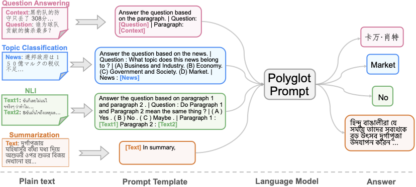

## Polyglot Prompting: Multilingual Multitask Prompt Training
<!-- [**Overview**](https://hub.fastgit.org/jinlanfu/Polyglot_Prompt#overview) |  -->
[**Overview**](#1) | 
[**Installation**](https://hub.fastgit.org/neulab/SpanNER#how-to-run) |
[**PolyPrompt Datasets**](https://hub.fastgit.org/neulab/SpanNER#demo) | 
[**Resources**](https://hub.fastgit.org/neulab/SpanNER#overview) | 
[**Running**](https://hub.fastgit.org/neulab/SpanNER#how-to-run) |
[**Bib**](https://hub.fastgit.org/neulab/SpanNER#bib)


This repository contains the code and datasets for our paper [Polyglot Prompting: Multilingual Multitask Prompt Training](https://arxiv.org/pdf/2204.14264.pdf).

<h2 id="1"> Overview </h2>
This paper aims for a potential architectural improvement for multilingual learning and asks: `Can different tasks from different languages be modeled in a monolithic framework, i.e. without any task/language-specific module? `

We approach this goal by developing a learning framework named Polyglot Prompting to exploit prompting methods for learning a unified semantic space for different languages and tasks with multilingual prompt engineering.
We performed a comprehensive evaluation of $6$ tasks, namely topic classification, sentiment classification, named entity recognition, question answering, natural language inference, and summarization, covering $24$ datasets and $49$ languages.  

<div  align="center">
 
</div>


## Quick Installation

- `Python==3.7`
- `torch==1.9.0`
- `transformers==4.15.0`

Run the following script to install the dependencies,
```
pip3 install -r requirements.txt
```


## PolyPrompt Datasets

How to use the PolyPrompt Datasets?
We have released all the datasets prompted with the best settings. We also provide two methods for downloading the original datasets.

### 1. Load the PolyPrompt Datasets from `DataLab`.

(1) Install `DataLab` with the following command:

```
pip install --upgrade pip
pip install datalabs
python -m nltk.downloader omw-1.4 # to support more feature calculation
```

More detailed instructions on installing `DataLab` can be found [here](https://github.com/ExpressAI/DataLab).


(2) After installing `DataLab`, the following code can be used to download/load datasets equipped with cross-language prompts.


```python
# pip install datalabs
from datalabs import load_dataset
dataset = load_dataset("poly_prompt","xquad.es")

# Get more information about the dataset.
print('dataset: ',dataset)
print(dataset['train'][0])
print(dataset['train']._info)
```
 
### 2. Build the PolyPrompt Datasets with our provided preprocessing code.

- `data_preprocess.py` is the data preprocessing code for seven target datasets (e.g., XNLI, TydiQA) and 15 non-target datasets (e.g., MCtest). You can use the prompt template to build the PolyPrompt Datasets.


## Resources

### Polyglot Prompt Templates
- `./templates/CL` is the cross-languge prompt templates explored in this work.
- `./templates/IL` is the in-languge prompt templates explored in this work.

### Preprocessed PolyPrompt Datasets
-  `7` target datasets with the cross-language prompt: [7targetdatas_CL](https://drive.google.com/file/d/19-87LAn-cSZnLhltBp2hEMkHDQIwKC3b/view?usp=share_link).
-  `15` non-target datasets with the cross-language prompt: [multilingual_expanddatas_CL](https://drive.google.com/file/d/1IrG6iCncyVO3l5dRvfJE4ifblafGhyg9/view?usp=sharing).
- The training set with `.pt` format for the PolyPrompt model: [7targetdatas_CL_train](https://drive.google.com/file/d/1NagSJf6f-cYk4Y7AOHWcsLU0laBZyccO/view?usp=share_link).


## How to Run?

Preprocess or download datasets with cross-language prompt templates, and place datasets in `./datas`.
Run the `train_mt5.py` with the following command:
```
export model_dir='./models'
export taskname="tydiqa,pawsx,xnli,mldoc,marc,mlqa,xquad"
export model_name="mt5base_polyprompt_crossLanguage"
export output_dir=${model_dir}/${model_name}
export model_path='google/mt5-base'
export datadir='./datas/'
export prompt_dir='./datas/templates/CL/'
export train_filename='train3k_promptCL_7datas_18w.pt'
export train_file_path=${datadir}/${train_filename}
export num_train_epochs=18
export save_steps=4000
export do_train=True # set do_train=False, if you don't need to fine-tuning the model.
export do_eval=True
export do_test=True
export PER_DEVICE_TRAIN_BATCH_SIZE=18
export PER_DEVICE_EVAL_BATCH_SIZE=2
export gradient_accumulation_steps=5
export eval_batch_size=100

CUDA_VISIBLE_DEVICES=2,3 python ./train_mt5.py \
    --output_dir=$output_dir \
    --taskname=${taskname} \
    --model_name_or_path=$model_path \
    --train_file_path=$train_file_path \
    --overwrite_output_dir=True \
     --per_device_train_batch_size=$PER_DEVICE_TRAIN_BATCH_SIZE \
     --per_device_eval_batch_size=$PER_DEVICE_EVAL_BATCH_SIZE \
     --source_max_len=512 \
     --target_max_len=64 \
     --eval_batch_size=$eval_batch_size \
     --gradient_accumulation_steps=${gradient_accumulation_steps} \
    --learning_rate=1e-4 \
    --num_train_epochs=$num_train_epochs \
    --save_steps=$save_steps \
    --do_train=$do_train \
    --do_eval=$do_eval \
    --data_dir=$datadir \
    --prompt_dir=$prompt_dir \
    --model_dir=$model_dir
```

The above commands can be found in `run_train.sh`.


If you just want to evaluate your own PolyPrompt model, you can run the following command:
```
./run_pred.sh
```


## Bib

```
@article{fu2022polyglot,
  title={Polyglot Prompt: Multilingual Multitask PrompTraining},
  author={Fu, Jinlan and Ng, See-Kiong and Liu, Pengfei},
  journal={EMNLP},
  year={2022}
}
```


